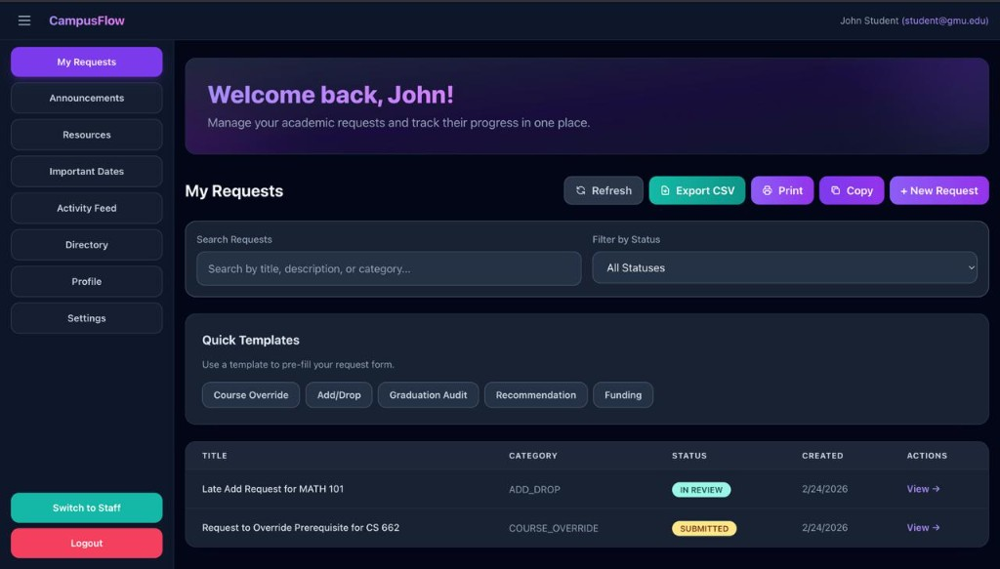
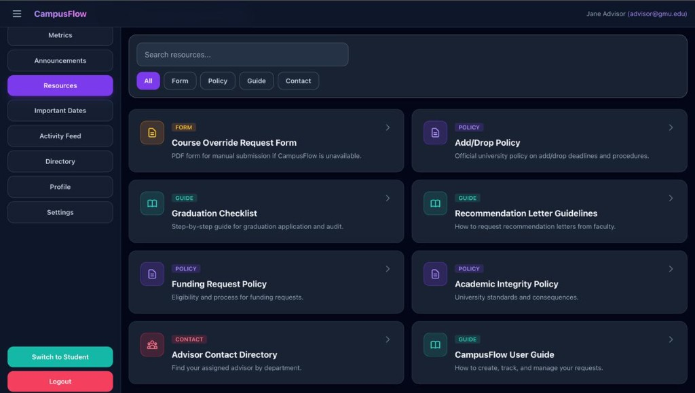

# CampusFlow

**Academic Request & Workflow Management System** — A campus-wide platform for students and staff to manage academic requests, approvals, and workflows. Built with React, Node.js, Express, Prisma, and PostgreSQL.

## 🚀 Quick Start

Clone the repo, navigate to the project folder, and run the setup script. Then start the app (see below) or follow the manual setup.

### Prerequisites
- Node.js 20+ and npm
- PostgreSQL 15+ installed and running
- Git

### Setup

1. **Run the setup script** (automates database and dependency setup): Run setup.sh from the project root.

Or manually:

2. **Install dependencies**: Install backend dependencies in the backend folder, then frontend dependencies in the frontend folder.

3. **Set up the database**: Create the campusflow database using createdb or psql.

4. **Configure environment variables**: Copy .env.example to .env in both backend and frontend directories, and update if needed.

5. **Initialize database**: From the backend folder, run prisma generate, prisma db push, and prisma:seed.

6. **Start the application**: Run the backend dev server in one terminal and the frontend dev server in another. Access the application at http://localhost:5173.

### Demo Credentials (for testing only)

Demo credentials are provided here for local testing. They are **not** shown in the application UI.

The system comes pre-seeded with multiple users:

- **Student** — student@gmu.edu / student123 — Role: STUDENT
- **Advisor** — advisor@gmu.edu / advisor123 — Role: ADVISOR
- **Professor** — professor@gmu.edu / professor123 — Role: PROFESSOR
- **Department Admin** — deptadmin@gmu.edu / deptadmin123 — Role: DEPT_ADMIN
- **Dean** — dean@gmu.edu / dean123 — Role: DEAN
- **Super Admin** — admin@gmu.edu / admin123 — Role: SUPER_ADMIN

## 📋 Features

### Student Features
- Create academic request tickets (title + description)
- View list of own requests
- View request details with AI-generated category and summary
- Add comments to own requests
- View audit log timeline

### Staff Features
- View all requests in queue
- Filter requests by status and category
- See SLA Risk badge for requests older than 24h still in SUBMITTED status
- Update request status (SUBMITTED → IN_REVIEW → NEEDS_INFO → APPROVED/REJECTED)
- Add comments to any request
- View metrics dashboard (total requests, by status, by category, avg resolution time, SLA risk count)

### AI Features (MVP)
- **Automatic Classification**: Rule-based keyword matching categorizes requests into COURSE_OVERRIDE, ADD_DROP, GRADUATION_AUDIT, RECOMMENDATION, FUNDING, GENERAL
- **AI Summary**: Generates 4-6 line summaries covering request intent, status, key details, and latest comments
- **Optional LLM Support**: Set OPENAI_API_KEY environment variable to enable LLM-based classification/summarization (falls back to rule-based if unavailable)

### Audit Logging
Every action creates an audit log entry: REQUEST_CREATED, STATUS_CHANGED (with from/to metadata), COMMENT_ADDED, ASSIGNMENT_CHANGED.

## 🏗️ Architecture

Frontend (React + Vite on port 5173) communicates via HTTP with the Backend API (Express + TypeScript on port 3001), which connects to PostgreSQL on port 5432.

### Tech Stack
- **Frontend**: React 18 + TypeScript + Vite + TailwindCSS
- **Backend**: Node.js 20 + Express + TypeScript
- **ORM**: Prisma
- **Database**: PostgreSQL 15

## 📁 Project Structure

Backend contains src (routes, services, middleware, prisma), prisma schema, .env.example, and package.json. Frontend contains src (pages, components, contexts, services, types), .env.example, and package.json. Root has setup.sh and README.md.

## 🔌 API Endpoints

**Health Check**: GET /health

**User**: GET /me — Headers: x-user-id, x-user-role

**Requests**:
- Create (STUDENT only): POST /requests with title and description
- List: GET /requests with optional status and category filters
- Get details: GET /requests/:id
- Update status (STAFF only): PATCH /requests/:id/status
- Add comment: POST /requests/:id/comments with message

**Metrics (STAFF only)**: GET /metrics

## 🧪 Demo Script

### 1. Start the System
Start the backend dev server in one terminal and the frontend dev server in another.

### 2. Access the Application
Open http://localhost:5173 in your browser.

### 3. Student Workflow
1. Ensure you're acting as Student (check navbar toggle)
2. Navigate to "My Requests"
3. Click "+ New Request"
4. Fill in title and description (e.g., "Request to Override Prerequisite for CS 662")
5. Click "Submit Request"
6. View the created request — notice the AI-generated category and summary
7. Add a comment

### 4. Staff Workflow
1. Click "Act as: Staff" in the navbar
2. Navigate to "Request Queue"
3. See all requests, including the one you just created
4. Click on a request to view details
5. Change status from SUBMITTED to IN_REVIEW
6. Add a comment
7. Notice the audit log shows all activity
8. Navigate to "Metrics" to see dashboard statistics

### 5. Using cURL (Alternative)
Login via POST to /api/auth/login to get an access token. Use the returned accessToken in the Authorization header for subsequent requests to create requests, list requests, update status, and get metrics.

## 🔧 Configuration

### Environment Variables

**Backend** (.env in backend/): DATABASE_URL, PORT, FRONTEND_URL, NODE_ENV, JWT_SECRET, JWT_REFRESH_SECRET, JWT_EXPIRES_IN, JWT_REFRESH_EXPIRES_IN, OPENAI_API_KEY

**Frontend** (.env in frontend/): VITE_API_URL

### Database Migrations
Run prisma migrate dev from the backend folder for development, or prisma migrate deploy for production.

### Seed Data
Run prisma:seed from the backend folder.

## 🐛 Troubleshooting

### Port Already in Use
If ports 3001, 5173, or 5432 are already in use, stop conflicting services or modify ports in .env files.

### Database Connection Issues
Check if PostgreSQL is running. Test the connection. To reset (WARNING: deletes all data): drop and recreate the database, then run prisma db push and prisma:seed from backend.

### Backend Not Starting
Check backend logs. Common issues: Prisma migrations failed (check DATABASE_URL), port conflict (check PORT), missing dependencies (run npm install).

### Frontend Not Loading
Check frontend logs. Verify VITE_API_URL matches backend URL. Check browser console for CORS errors. Clear browser cache.

### Prisma Issues
From backend: regenerate Prisma client with prisma generate. To reset database and re-seed: prisma db push with accept-data-loss, then prisma:seed.

## 📸 Screenshots

**Student Dashboard — My Requests**
Manage academic requests, search, filter, use quick templates, and track request status.

**Resources Page**
Browse forms, policies, guides, and contact information.

## 🔒 Security Notes

**⚠️ MVP Implementation**: This is an MVP with simplified authentication using headers. For production: implement proper authentication (JWT, OAuth), add rate limiting, CSRF protection, input sanitization, environment-specific secrets, HTTPS, request validation middleware, and proper RBAC with database-backed roles.

## 📝 License

MIT

---

Built as a production-quality MVP for academic request management.
